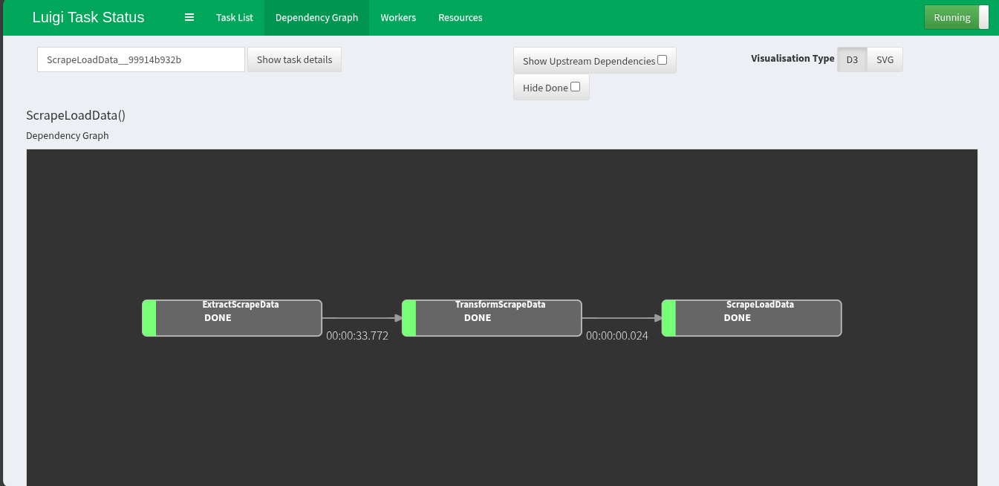
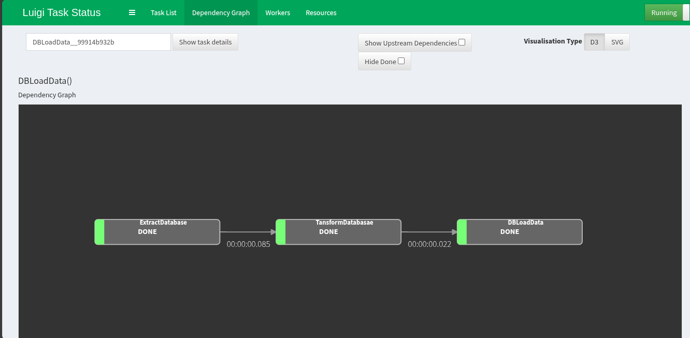

# Usecase

---

**Scraping Data**

- Data yang akan discraping adalah data di website https://quotes.toscrape.com/
- Pada proses Trasnform, program akan menghilangkan karakter unicode
- Setelah itu, data akan disimpan di database `quotes`

**Data Marketing**

- Data marketing disimpan di postgres dengan nama database 'luigi' dan tabel `mall_customers_raw`
- Pada proses Transform, akan dilakukan perubahan nama tabel dan mengganti value pada kolom `gender` menjadi
  - `Male`: `male`
  - `Female`: `male`
- Setelah itu, data akan disimpan di table `mall_customers_clean`

# Usage

---

- Jalankan kode utama etl pipeline dengan luigi
  ```bash
  python etl_pipeline.py
  ```
- Perintah untuk mengakses UI luigi
  ```bash
  luigid --port 8082
  ```

# ETL Pipeline Result

---

**Scraping Data**


**Data Marketing**

